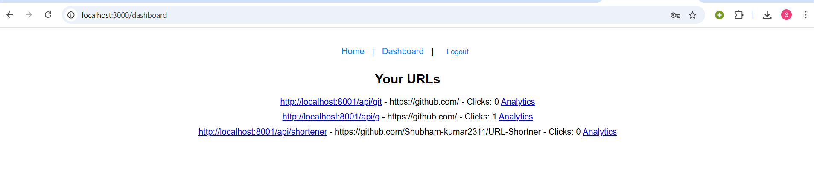

# URL Shortener Application

Welcome to the URL Shortener Application, a full-stack web application built with the MERN stack (MongoDB, Express.js, React, Node.js). This project allows users to shorten URLs, track analytics (e.g., click counts), and manage their links with user authentication. The application is designed for scalability and ease of deployment, with support for hosting on platforms like Vercel.

## Features
- **URL Shortening**: Convert long URLs into short, unique links.
- **User Authentication**: Register and log in to manage your shortened URLs.
- **Analytics**: Track click counts and creation dates for each shortened URL.
- **Custom Short IDs**: Option to specify custom short IDs (if available).
- **Token-Based Authentication**: Secure API access with JWT tokens.
- **Responsive Design**: Accessible on desktop and mobile devices.
- **Deployment Ready**: Optimized for hosting on Vercel with serverless functions.

## Technologies
- **Frontend**: React, React Router, Axios/Fetch API
- **Backend**: Node.js, Express.js, Serverless Functions (Vercel)
- **Database**: MongoDB (local or Atlas)
- **Authentication**: JSON Web Tokens (JWT)
- **Utilities**: Nanoid (for generating unique short IDs)
- **Deployment**: Vercel
- **Development Tools**: Node.js, npm, MongoDB Shell

## Installation

### Prerequisites
- Node.js (v14.x or higher)
- npm (v6.x or higher)
- MongoDB (local instance or MongoDB Atlas)
- Git (for version control)

### Clone the Repository
git clone https://github.com/Shubham-kumar2311/URL-Shortner
cd repository

### To run
npm install-all
npm start

